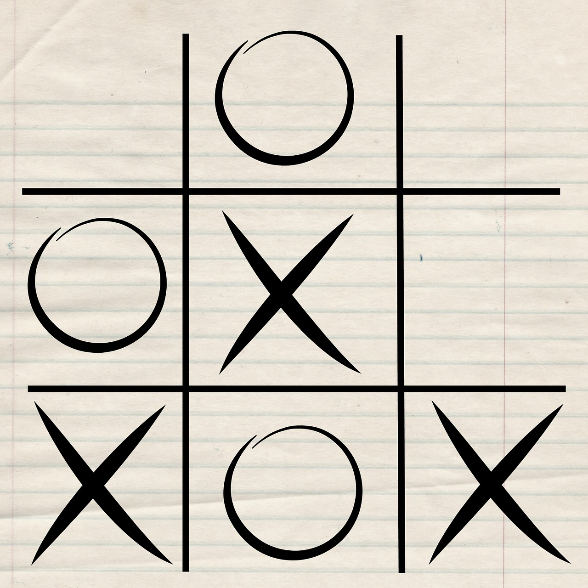

# How to play tic-tac-toe

Tic-tac-toe is a classic two-player game that can be played using pen and paper. The objective is to win by connecting three "X"s or three "O"s first in a straight or diagonal line. To get started, it is important to define the rules and consider some important steps.

1. Create a three-by-three grid resembling the **#** symbol.
2. Each player must decide before the start of the game to play with "X" or to play with "O".
3. It is standard for the player with "X" to go first. The first move may be made on any square in the three-by-three **#** grid.
4. Each player take turns placing their symbol ("X" or "O") on an empty square.
5. The first player to connect three "X"s or three "O"s in a straight or diagonal line wins.
6. If not, the game ends in a draw and the players may choose to play a new round.

> [!NOTE]
> There are a couple of common strategies to increase your odds of winning. The player that moves first should try to occupy the center or corners of the grid. The player that moves second should anticipate the next move and block out any squares that would create a fork, a scenario where a player has two ways of winning simutaneously.

## Next steps

To learn more about the comprehensive rules and strategies for tic-tac-toe, you may consider the following sources.

1. [How to Play Tic Tac Toe](https://www.wikihow.com/Play-Tic-Tac-Toe)
2. [How to Win at Tic Tac Toe](https://www.wikihow.com/Win-at-Tic-Tac-Toe)

